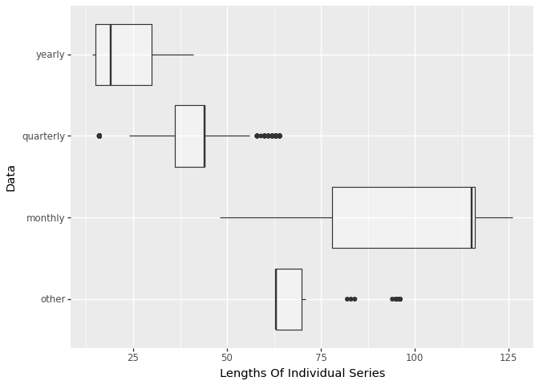
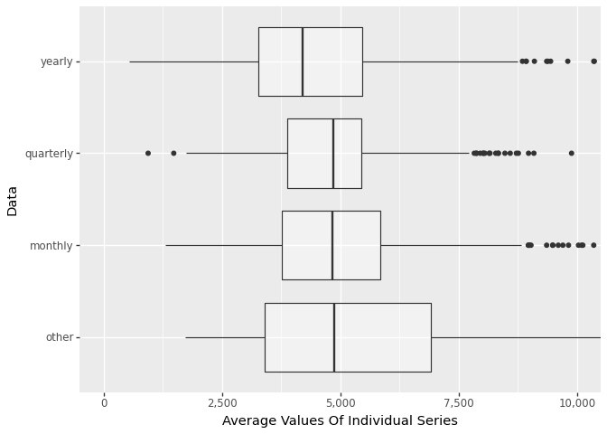
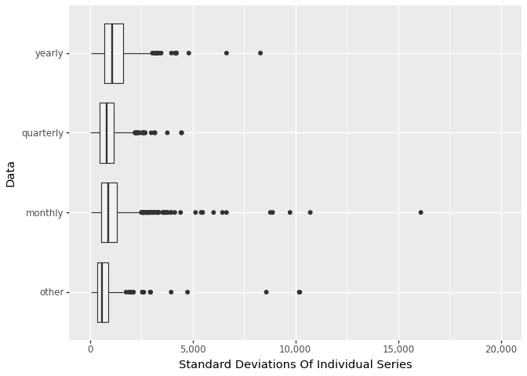
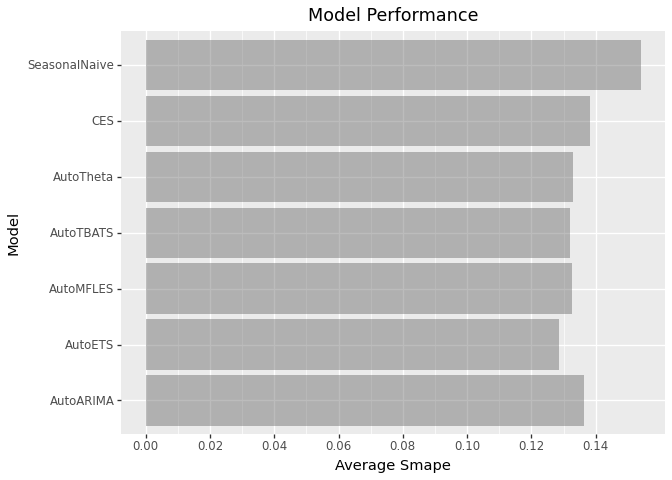

# Summary

This repo takes the
[M3](https://www.sciencedirect.com/science/article/abs/pii/S0169207000000571)
competition’s data and builds 7 different models:

- Seasonal Naive
- Auroregressive Integrated Moving Average (ARIMA)
- Error Trend Seasonality (ETS)
- Complex Exponential Smoothing (CES)
- Theta
- Median, Frourier Functions, Linear Trend, Exponential Smoothing
  (MFLES)
- Trigonomic Box-Cox, ARMA, Trend and Seasonal Components (TBATS)

### Data Exploration

The M3 competition was run in 2000 and contained 3,003 series.

Long frequency data (i.e. yearly) tend to be shorter series than short
frequency series (i.e. monthly). Within each dataset, the length of each
series is inconsistent.

There is large variability in average values of series in all datasets.

Within each dataset, there is large variability in standard deviations
of series.

# Model Summary

### Comparison with Other Participants

The seasonal naive model did surprisingly well. However, all 6
statistical models were able to beat it. Error Trend Seasonality is the
best model.

# Code Overview

Run order:

- prep_data
- train_stats_models
- summarize_results

A conda environment file is provided for running the code on Ubuntu.
